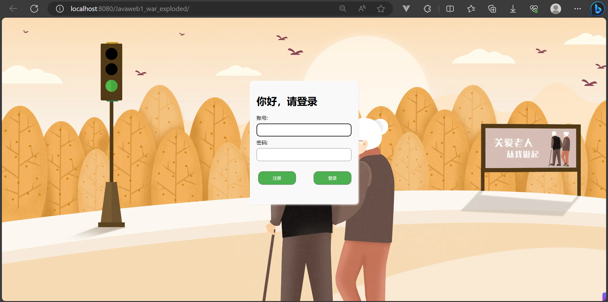
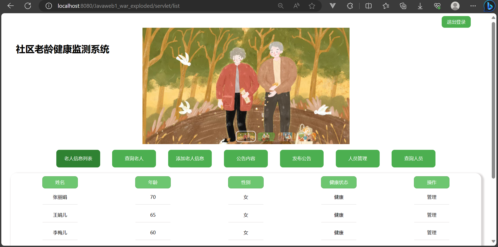
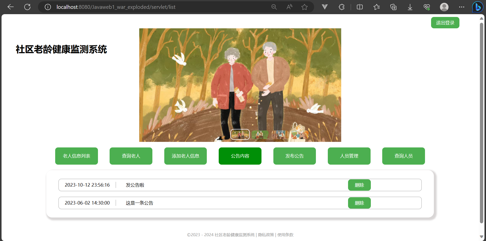
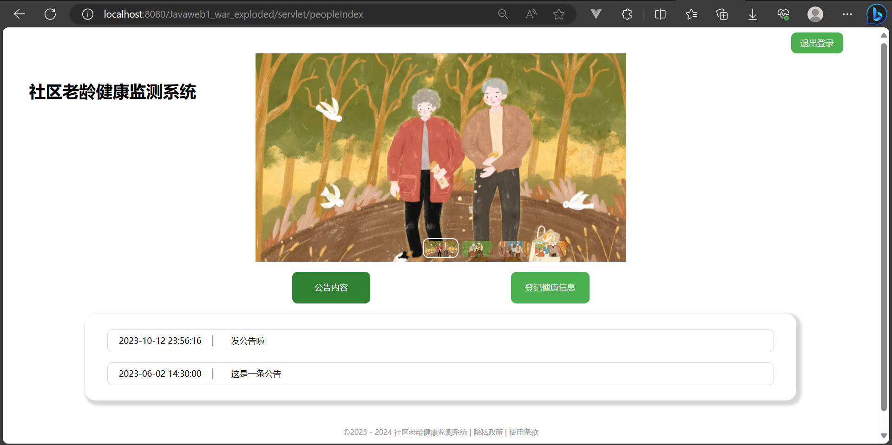

# 社区老龄健康登记系统

本系统是 Javaweb 课程大作业，基于JDK17、MySQL8、Tomcat10开发的。

社区老龄健康监测登记系统主要用于社区管理者对老年人健康情况的监测和登记，主要实现功能：1. 用户管理功能   2. 老人健康状态登记   3. 公告发布和管理

Tomcat安装包、jar包以及数据库文件在 “大三下JavaWeb” 文件夹下，整个大小为60+MB，下载或克隆时请耐心等待。

##### 系统使用步骤：

1. 下载或克隆本项目到本地
2. 将  “大三下JavaWeb”  文件夹复制到D盘
3. 在MySQL中新建数据库 “community”，并导入本项目提供的“community.sql”
4. 用IDEA打开文件夹  “Javaweb的项目1”  
5. 配置tomcat、jdk等（只要是按照我的步骤进行，是不用配置的）
6. 运行

##### 运行截图：

如运行出现问题，请加群：617545186